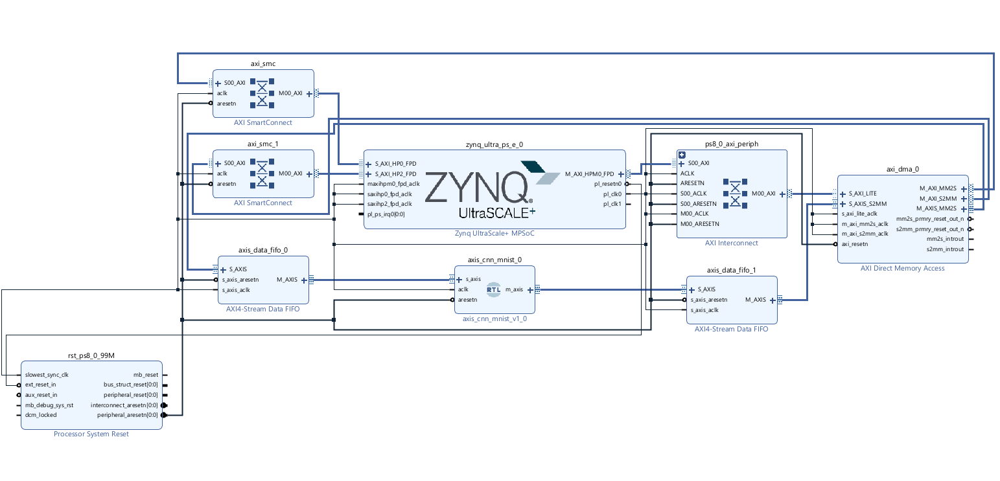

# FPGA CNN Inference Accelerator (MNIST)

A synthesizable Verilog RTL accelerator for handwritten digit classification, built as an AXI4-Stream IP core for integration into a Zynq/PYNQ system. The design was brought up on an RFSoC4x2 (Zynq UltraScale+ MPSoC) with PS–PL data movement handled via AXI DMA and AXI4-Stream FIFOs.

## Block Design



The `axis_cnn_mnist_v1_0` RTL core sits between two AXI4-Stream Data FIFOs, fed by `axi_dma_0` for PS↔PL data movement. The Zynq UltraScale+ MPSoC drives the interconnects (`axi_smc`, `axi_smc_1`, AXI Interconnect) and clocking/reset (`rst_ps8_0_99M`, Processor System Reset) for the whole system.

## Architecture

The core (`axis_cnn_mnist`) implements a fully pipelined CNN inference datapath:

```
AXI-Stream in (8-bit pixel)
        │
   conv1_layer   (conv1_buf + conv1_calc, 3 output channels)
        │
  maxpool_relu    (12x12 → pooled)
        │
   conv2_layer    (conv2_buf + conv2_calc, 3 output channels)
        │
  maxpool_relu    (4x4 → pooled)
        │
 fully_connected  (48 → 10 classes)
        │
   comparator     (argmax over 10 class scores)
        │
AXI-Stream out (4-bit class decision)
```

A single global counter-based sequencer (`cnt_sequencer_reg`) in the top module drives the whole pipeline: it gates the AXI-Stream `tready`/`tvalid` handshake, times the streaming-in of all 784 (28×28) input pixels, and marks the output valid once the classification decision is ready.

### Modules

| File | Role |
|---|---|
| `axis_cnn_mnist.v` | Top-level AXI4-Stream wrapper; sequences the pipeline and handles handshaking |
| `conv1_buf.v` / `conv1_calc.v` / `conv1_layer.v` | First convolution stage (line-buffering + MAC compute), 3 output channels |
| `conv2_buf.v` / `conv2_calc.v` / `conv2_layer.v` | Second convolution stage on the pooled conv1 output, 3 output channels |
| `maxpool_relu.v` | Parameterized 2×2 max-pooling + ReLU, reused after both conv stages |
| `fully_connected.v` | Fully connected layer (48 → 10) producing per-class scores |
| `comparator.v` | Pipelined argmax over the 10 class scores to produce the final decision |

## System Integration

On hardware, this IP core sits inside a PYNQ block design (see above): pixel data is streamed in from PS memory via `axi_dma_0` through an AXI4-Stream FIFO, processed by `axis_cnn_mnist_v1_0`, and the classification result is streamed back through a second FIFO and DMA channel to PS. Achieved an average **12x speedup** over CPU-only inference on the same Zynq SoC.

## Status

Verified via behavioral simulation and hardware bring-up on RFSoC4x2 with PYNQ.
